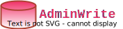
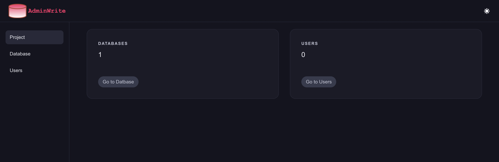
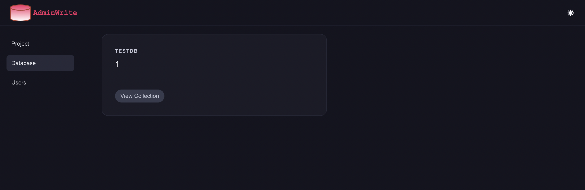
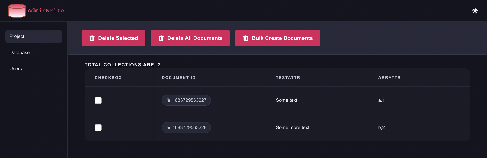
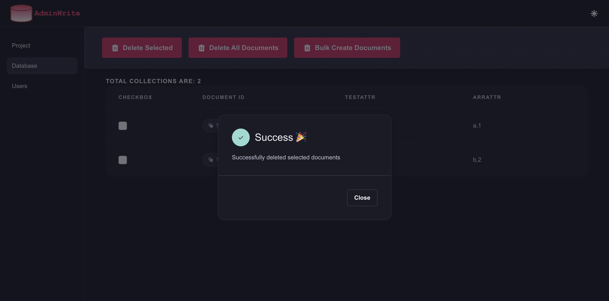
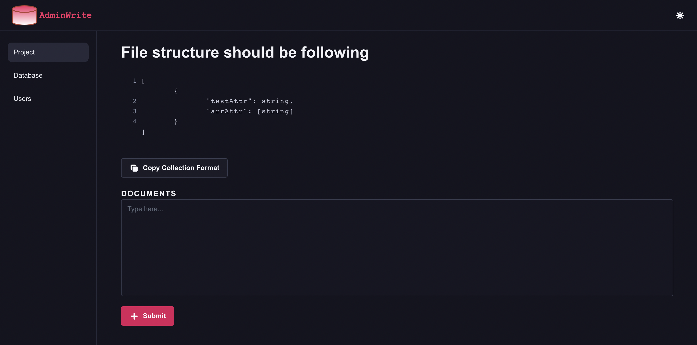
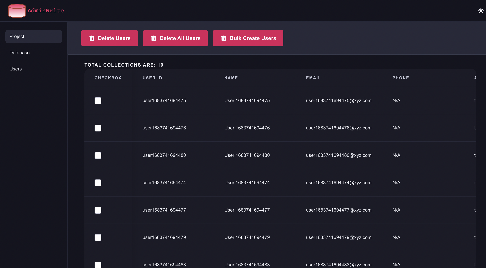
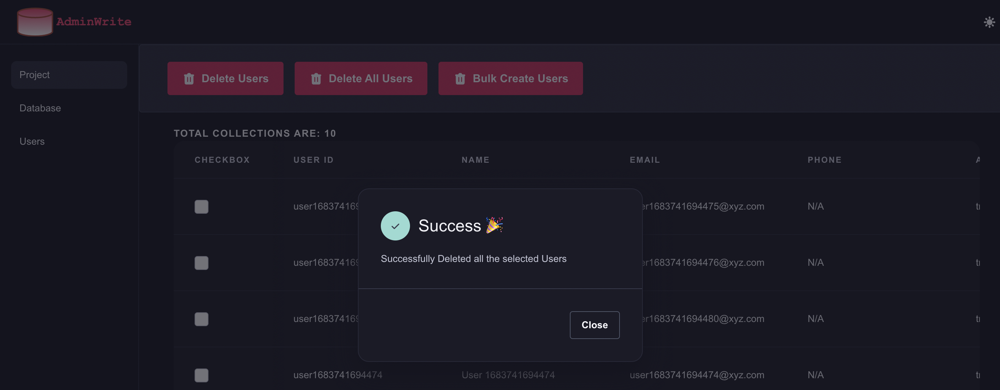
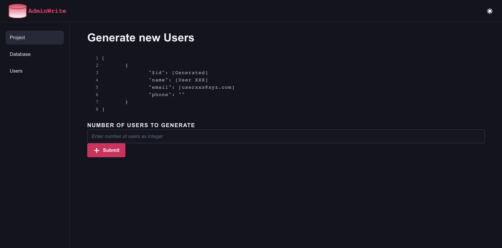

# AdminWrite

## 📝 What is AdminWrite?

AdminWrite is a helper for Appwrite to perform bulk operations during development. Currently Database and Uses are supported with the following operations:
* Select Deleted (100 in 1 request)
* Delete All (100 in 1 request)
* Bulk Create

#### Additional Specific Feature
* During the Bulk Document creation, according to the attributes the structure of document is present in the view.
* The structure of document can also be copied by using the `Copy Document Format` Button.
## 🧰 Tech Stack

- [Appwrite](https://appwrite.io/)
- [Svelte Kit](https://kit.svelte.dev/)
- [Pink Design](https://pink.appwrite.io/)
- [TypeScript](https://www.typescriptlang.org/)

## 🛠️ Setup Server

1. Setup Appwrite server
2. Create your Appwrite project

## 👀 Setup Client

1. Install libarries `npm install`
2. Duplicate `.dup.env` file and rename it to `.env`.
3. Update the following environment variables in `.env` file:
    - `PUBLIC_APPWRITE_ENDPOINT` - Appwrite instance endpoint.
    - `PUBLIC_APPWRITE_PROJECT` - Project ID of your Appwrite project
    - `PUBLIC_APPWRITE_KEY` - Generate a Key from Appwrite console and provide all permissions.
## 🚀 Run Locally

1. Run `npm run dev`.
2. By default the application will run on [`http://localhost:5173/`](http://localhost:5173/).

## 🤝 Contributing

* Raise a new issue.
* Code contribution:
    * Fork the Repo
    * Create a new branch as `fix-issue-description`
    * Raise the PR.

## 📖 References
* [Pink Design](https://pink.appwrite.io/)
* [SvelteKit Appwrite Starter](https://github.com/Meldiron/appwrite-ssr-svelte-kit/tree/main)

## 🖼️ Screenshots
*AdminWrite Home*

*AdminWrite Database*

*AdminWrite Document View*

*AdminWrite Delete Document*

*AdminWrite Bulk Document Create*

*AdminWrite Users View*

*AdminWrite Users Delete*

*AdminWrite Bulk User Create*



## 🤖 Auto-generated documentation

Everything you need to build a Svelte project, powered by [`create-svelte`](https://github.com/sveltejs/kit/tree/master/packages/create-svelte).

## Creating a project

If you're seeing this, you've probably already done this step. Congrats!

```bash
# create a new project in the current directory
npm create svelte@latest

# create a new project in my-app
npm create svelte@latest my-app
```

## Developing

Once you've created a project and installed dependencies with `npm install` (or `pnpm install` or `yarn`), start a development server:

```bash
npm run dev

# or start the server and open the app in a new browser tab
npm run dev -- --open
```

## Building

To create a production version of your app:

```bash
npm run build
```

You can preview the production build with `npm run preview`.

> To deploy your app, you may need to install an [adapter](https://kit.svelte.dev/docs/adapters) for your target environment. No Adapter is installed and is meant to run locally.
